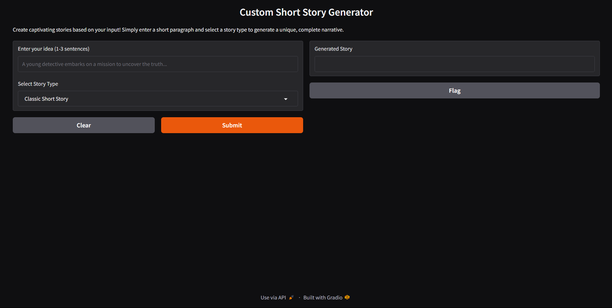
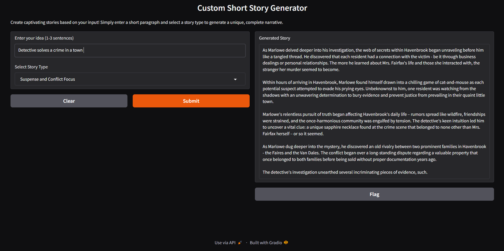

# Custom Short Story Generator

This is a short story generation app that creates short stories based on user input and selected story types. It uses an open-source model with Gradio for a simple interface and LangChain for prompt optimization, ensuring efficient and quick generation.

## Objectives

-  Enable users to generate short stories based on different themes and styles.

- Provide a seamless, interactive interface using Gradio.

- Ensure quick and efficient story generation with a lightweight model.

- Optimize prompts for better output and model performance using LangChain.

## Model Summary

The Phi-3-Mini-4K-Instruct is a 3.8B parameters, lightweight, state-of-the-art open model trained with the Phi-3 datasets that includes both synthetic data and the filtered publicly available websites data with a focus on high-quality and reasoning dense properties.

Link to repo:
https://huggingface.co/microsoft/Phi-3-mini-4k-instruct-gguf

## Output

